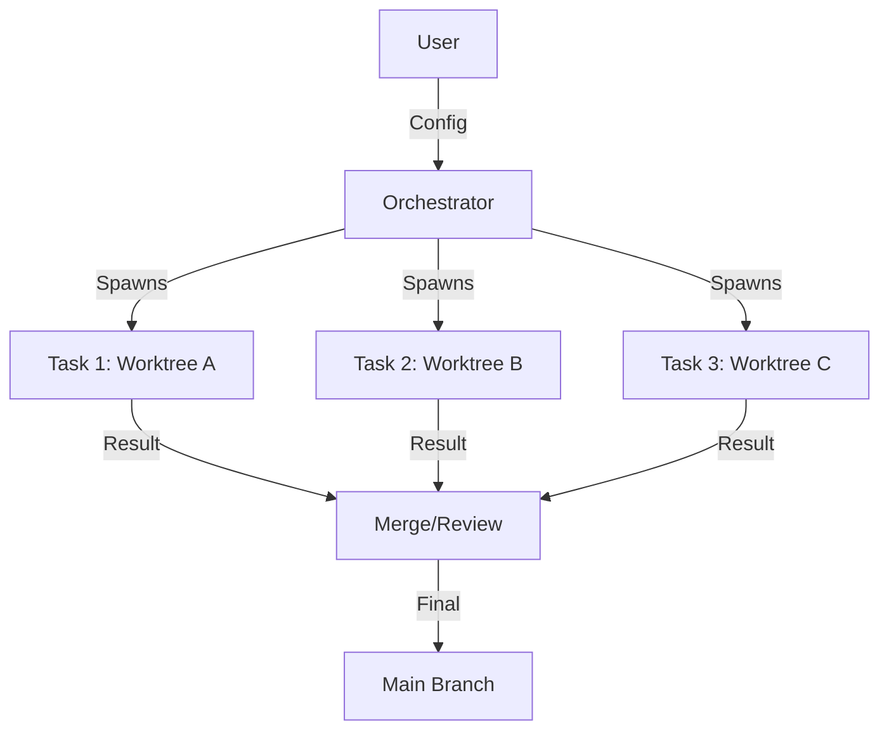

# System Patterns

## Architecture Overview
The system follows a central **Orchestrator** pattern controlling distributed **Workers**.

## Key Components

### 1. Orchestrator (`framework/orchestrator/orchestrator.py`)
- **Responsibility**: Parse config, manage git worktrees, spawn agent processes, monitor progress.
- **Config**: `orchestrator.json` defines the graph of tasks and dependencies.

### 2. Task Definitions (`framework/tasks/*.md`)
- **Format**: Markdown files containing prompt templates.
- **Content**: Role definition, context, specific instructions, expected output format.

### 3. Runners
- **Abstraction**: A wrapper around different AI tools (Claude, Codex, Aider).
- **Execution**: Takes a prompt and a worktree path, executes the tool in that context.

### 4. Git Worktree Manager
- **Isolation**: Creates `_worktrees/{phase}/{task}`.
- **Lifecycle**: Setup -> Execute -> Commit -> Cleanup/Merge.

## Design Patterns

- **Command Pattern**: Encapsulating AI execution requests as task objects.
- **Strategy Pattern**: Pluggable runners for different AI backends.
- **Template Method**: Standardized phases (Discovery, Main, Review, Post).

## Directory Structure
- `framework/`: Core logic and configurations.
- `claude-code/`: Documentation for autonomous AI behavior protocols.
- `scripts/`: Helper utilities (packaging, installation).
